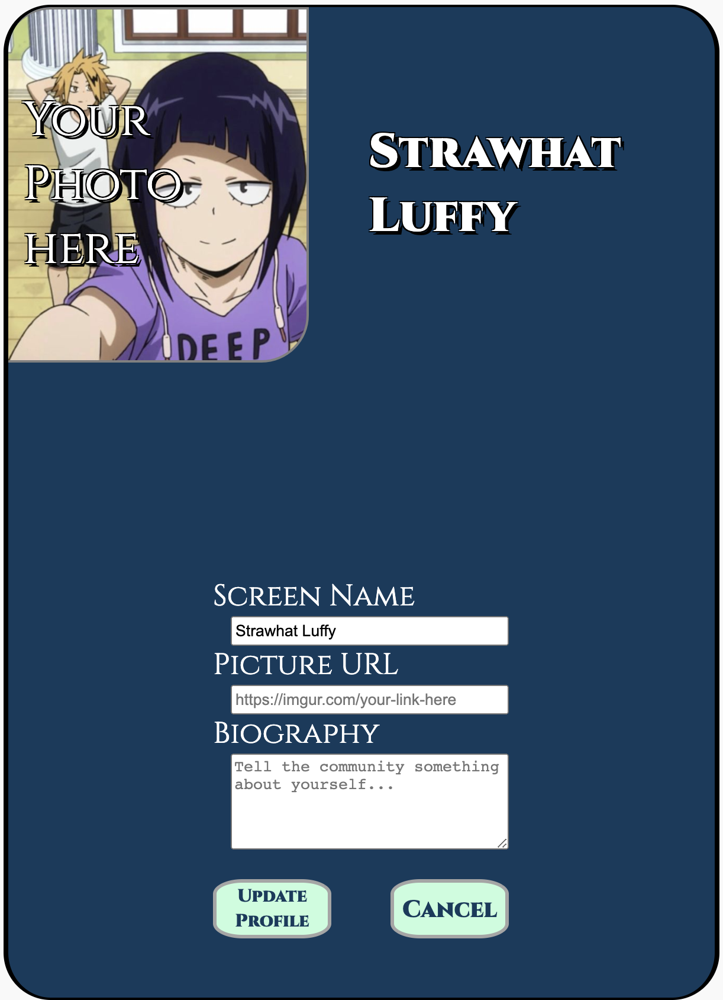
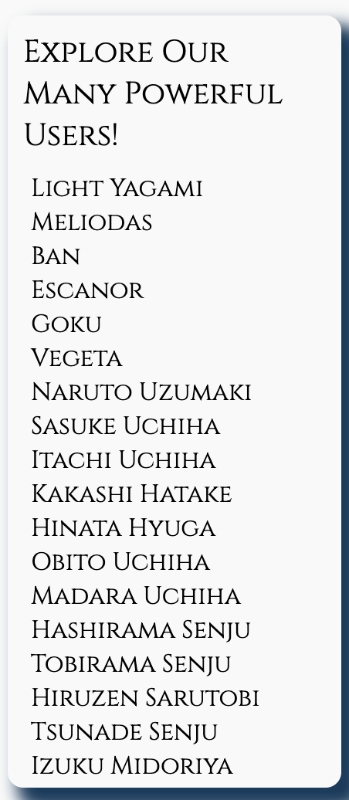
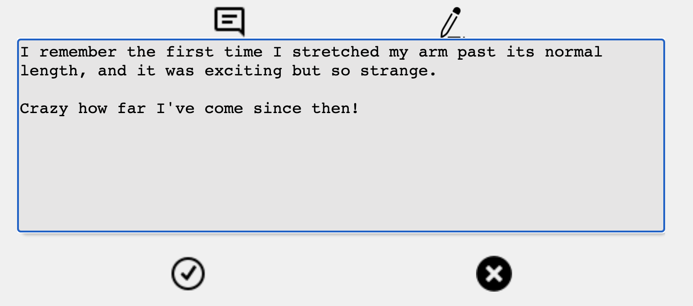
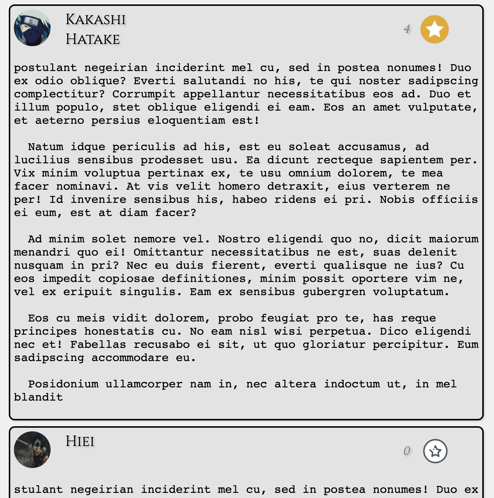
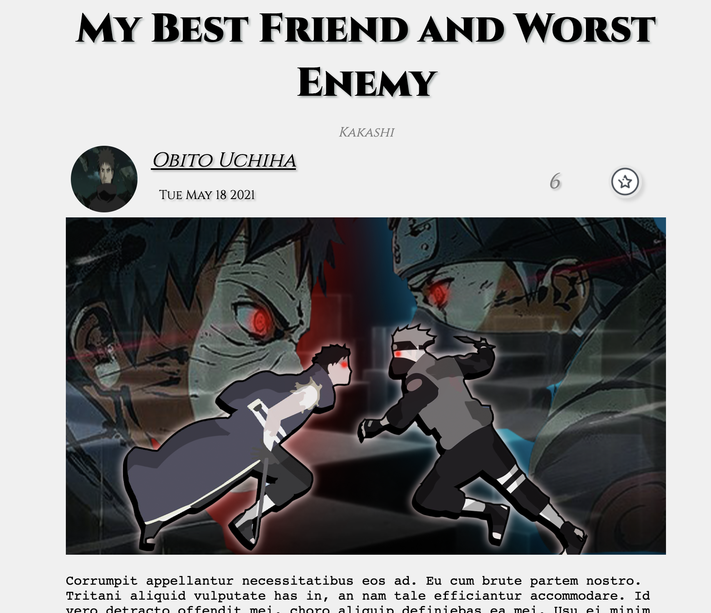
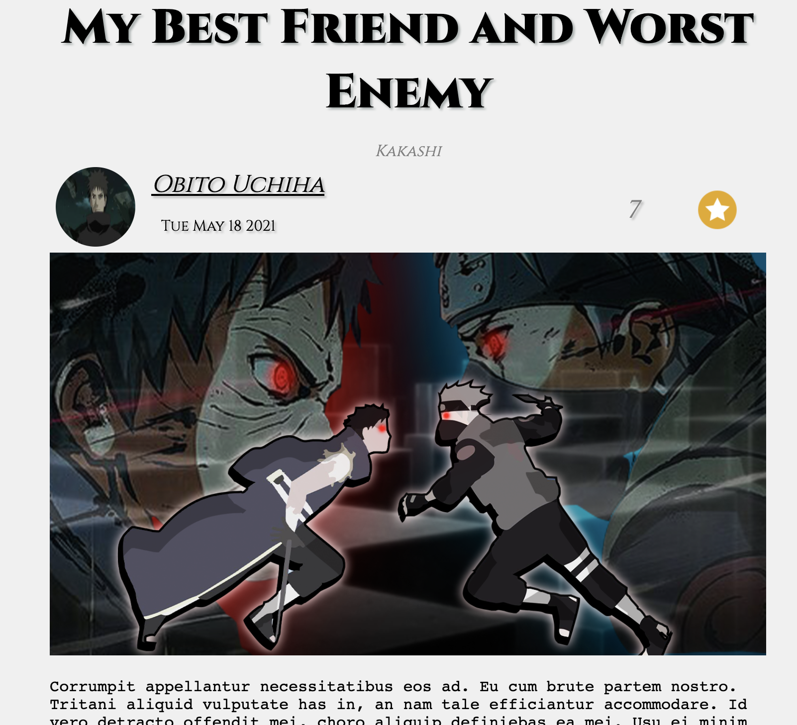
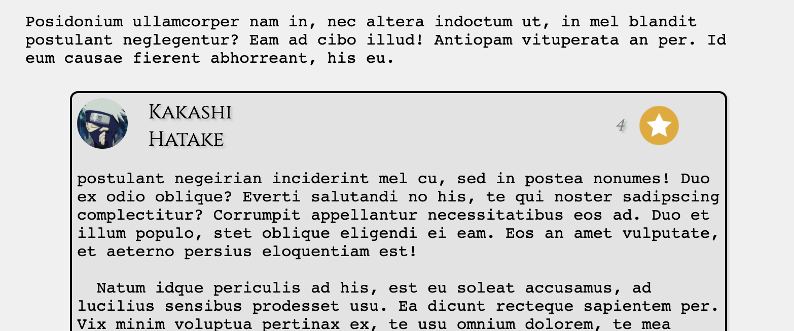

# Animedium
## _Anime based Medium clone_


Animedium is a gathering place for anime characters and enthusiasts alike to share their favorite stories and moments from their favorite animes.

## Features

- Users can create and edit their profiles.
- Users can create and edit their stories.
- Users can comment on each others posts.
- Users can like comments and stories.

## Tech

Animedium uses a number of open source projects to work properly:

- Pug -
- Express -
- Sequelize -
- PostgreSQL -

## Installation

Install the dependencies and devDependencies and start the server.

```sh
git clone https://github.com/mike4344/Medium-clone.git
npm install
npm start

```


## Features


### Users can create and edit their story
>* The pencil on the navbar takes a user to a page where they can write a story that other users can like and comment on. 
>* Each story has a title, an option for a subtitle and image (from a url), and a body. 
>* If the user wants to adjust their story, they can edit, and authorization ensures that a user can only edit stories that they've personally written.  


### Users can create and edit their profile
>* Every user has a personal profile where they can show off some personality! Profiles can take an image, and a biography, and users can change their name if they want.
>* Users can also check out other user profiles by clicking through from the main page.




### Users can write and view comments
>* Every story can be commented on, or a user can simply lurk and read comments if that is more their style. 



### Users like comments and stories
>* A user can interact with stories they or other users have written by liking the stories, and the same goes for comments. 
>* The comment button is the little star that looks like a dragonball, and we use AJAX to seamlessly make calls to the database so that a user will get the instant gratification of seeing the 'dragonball' light up when they click it. 




<!-- ## Pushing to Heroku
```
git push heroku main:master
heroku run npm run sequelize db:migrate
heroku run npm run sequelize db:seed:all
``` -->